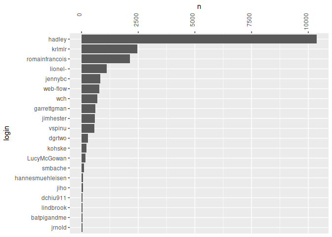
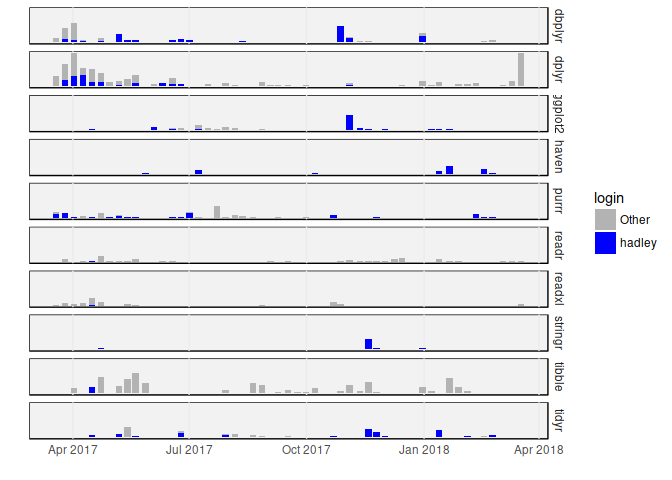

Exploratory analysis of tidyverse activity
================
Duncan Garmonsway
Sun Mar 18 06:42:00 2018

``` r
library(tidyverse)
library(gh)
library(git2r)
library(fs)
library(lubridate)
library(tibbletime)
library(here)

rate_limit <- function() gh("/rate_limit")
rate_limit()
```

    ## {
    ##   "resources": {
    ##     "core": {
    ##       "limit": 5000,
    ##       "remaining": 5000,
    ##       "reset": 1521358921
    ##     },
    ##     "search": {
    ##       "limit": 30,
    ##       "remaining": 30,
    ##       "reset": 1521355381
    ##     },
    ##     "graphql": {
    ##       "limit": 5000,
    ##       "remaining": 5000,
    ##       "reset": 1521358921
    ##     }
    ##   },
    ##   "rate": {
    ##     "limit": 5000,
    ##     "remaining": 5000,
    ##     "reset": 1521358921
    ##   }
    ## }

``` r
dir_create(here::here("repos"))

tidyverse_members <- gh("/orgs/:org/members", org = "tidyverse")
member_names <- map_chr(tidyverse_members, ~ .x[["login"]])

tidyverse_repos <-
  gh("/orgs/:org/repos", org = "tidyverse") %>%
  map_chr(~ .x[["ssh_url"]]) %>%
  tibble(name = str_extract(basename(.), "^.*(?=\\.)"),
         url = .,
         local_path = path_abs(path("repos", name)))

repo_dirs <- dir_ls(here::here("repos"))

existing_repos <- filter(tidyverse_repos, local_path %in% repo_dirs)
new_repos <- anti_join(tidyverse_repos, existing_repos, by = "local_path")
```

Clone new repos locally

``` r
new_repos %>%
  pwalk(~ clone(..2, ..3)) %>%
  print(n = Inf)
```

    ## # A tibble: 0 x 3
    ## # ... with 3 variables: name <chr>, url <chr>, local_path <fs::path>

Pull existing repos locally

``` r
existing_repos %>%
  pwalk(~ pull(repository(..3))) %>%
  print(n = Inf)
```

    ## # A tibble: 27 x 3
    ##    name          url       local_path                                     
    ##    <chr>         <chr>     <fs::path>                                     
    ##  1 ggplot2       git@gith… /home/nacnudus/R/rstudioeye/repos/ggplot2      
    ##  2 lubridate     git@gith… /home/nacnudus/R/rstudioeye/repos/lubridate    
    ##  3 stringr       git@gith… /home/nacnudus/R/rstudioeye/repos/stringr      
    ##  4 dplyr         git@gith… /home/nacnudus/R/rstudioeye/repos/dplyr        
    ##  5 readr         git@gith… /home/nacnudus/R/rstudioeye/repos/readr        
    ##  6 magrittr      git@gith… /home/nacnudus/R/rstudioeye/repos/magrittr     
    ##  7 tidyr         git@gith… /home/nacnudus/R/rstudioeye/repos/tidyr        
    ##  8 broom         git@gith… /home/nacnudus/R/rstudioeye/repos/broom        
    ##  9 purrr         git@gith… /home/nacnudus/R/rstudioeye/repos/purrr        
    ## 10 haven         git@gith… /home/nacnudus/R/rstudioeye/repos/haven        
    ## 11 readxl        git@gith… /home/nacnudus/R/rstudioeye/repos/readxl       
    ## 12 reprex        git@gith… /home/nacnudus/R/rstudioeye/repos/reprex       
    ## 13 tibble        git@gith… /home/nacnudus/R/rstudioeye/repos/tibble       
    ## 14 hms           git@gith… /home/nacnudus/R/rstudioeye/repos/hms          
    ## 15 modelr        git@gith… /home/nacnudus/R/rstudioeye/repos/modelr       
    ## 16 forcats       git@gith… /home/nacnudus/R/rstudioeye/repos/forcats      
    ## 17 tidyverse     git@gith… /home/nacnudus/R/rstudioeye/repos/tidyverse    
    ## 18 tidytemplate  git@gith… /home/nacnudus/R/rstudioeye/repos/tidytemplate 
    ## 19 blob          git@gith… /home/nacnudus/R/rstudioeye/repos/blob         
    ## 20 ggplot2-docs  git@gith… /home/nacnudus/R/rstudioeye/repos/ggplot2-docs 
    ## 21 glue          git@gith… /home/nacnudus/R/rstudioeye/repos/glue         
    ## 22 style         git@gith… /home/nacnudus/R/rstudioeye/repos/style        
    ## 23 dbplyr        git@gith… /home/nacnudus/R/rstudioeye/repos/dbplyr       
    ## 24 googledrive   git@gith… /home/nacnudus/R/rstudioeye/repos/googledrive  
    ## 25 googlesheets4 git@gith… /home/nacnudus/R/rstudioeye/repos/googlesheets4
    ## 26 tidyselect    git@gith… /home/nacnudus/R/rstudioeye/repos/tidyselect   
    ## 27 tidyverse.org git@gith… /home/nacnudus/R/rstudioeye/repos/tidyverse.org

``` r
repo_dirs <- dir_ls(here::here("repos"))
```

Structure of a commit

``` r
commits(repository(as.character(repo_dirs[1]))) %>%
  .[[1]] %>% str()
```

    ## Formal class 'git_commit' [package "git2r"] with 6 slots
    ##   ..@ sha      : chr "bef080ca9fbf916abbcc6effb69f124991fc740b"
    ##   ..@ author   :Formal class 'git_signature' [package "git2r"] with 3 slots
    ##   .. .. ..@ name : chr "Kirill Müller"
    ##   .. .. ..@ email: chr "krlmlr+r@mailbox.org"
    ##   .. .. ..@ when :Formal class 'git_time' [package "git2r"] with 2 slots
    ##   .. .. .. .. ..@ time  : num 1.51e+09
    ##   .. .. .. .. ..@ offset: num 60
    ##   ..@ committer:Formal class 'git_signature' [package "git2r"] with 3 slots
    ##   .. .. ..@ name : chr "Kirill Müller"
    ##   .. .. ..@ email: chr "krlmlr+r@mailbox.org"
    ##   .. .. ..@ when :Formal class 'git_time' [package "git2r"] with 2 slots
    ##   .. .. .. .. ..@ time  : num 1.51e+09
    ##   .. .. .. .. ..@ offset: num 60
    ##   ..@ summary  : chr "Merge tag 'v1.1.0.9001'"
    ##   ..@ message  : chr "Merge tag 'v1.1.0.9001'\n\n- Now using the prettyunits package to format data sizes.\n"
    ##   ..@ repo     :Formal class 'git_repository' [package "git2r"] with 1 slot
    ##   .. .. ..@ path: chr "/home/nacnudus/R/rstudioeye/repos/blob"

Import all commits

``` r
tidyverse_commits <-
  repo_dirs %>%
  tibble(repo_dir = .,
         commit = map(repo_dir, ~ commits(repository(as.character(.x))))) %>%
  unnest() %>%
  mutate(repo = basename(repo_dir),
         committed = ymd_hms(map_chr(commit, when)),
         name = map_chr(commit, ~ .x@committer@name),
         email = map_chr(commit, ~ .x@committer@email)) %>%
  print()
```

    ## # A tibble: 22,426 x 6
    ##    repo_dir                               commit repo  committed          
    ##    <fs::path>                             <list> <chr> <dttm>             
    ##  1 /home/nacnudus/R/rstudioeye/repos/blob <S4: … blob  2017-11-30 10:35:21
    ##  2 /home/nacnudus/R/rstudioeye/repos/blob <S4: … blob  2017-11-30 10:35:17
    ##  3 /home/nacnudus/R/rstudioeye/repos/blob <S4: … blob  2017-11-30 10:35:15
    ##  4 /home/nacnudus/R/rstudioeye/repos/blob <S4: … blob  2017-11-30 10:35:08
    ##  5 /home/nacnudus/R/rstudioeye/repos/blob <S4: … blob  2017-11-29 16:05:04
    ##  6 /home/nacnudus/R/rstudioeye/repos/blob <S4: … blob  2017-11-29 09:40:17
    ##  7 /home/nacnudus/R/rstudioeye/repos/blob <S4: … blob  2017-11-29 09:40:13
    ##  8 /home/nacnudus/R/rstudioeye/repos/blob <S4: … blob  2017-11-29 09:40:10
    ##  9 /home/nacnudus/R/rstudioeye/repos/blob <S4: … blob  2017-11-29 09:39:44
    ## 10 /home/nacnudus/R/rstudioeye/repos/blob <S4: … blob  2017-11-29 09:38:20
    ## # ... with 22,416 more rows, and 2 more variables: name <chr>, email <chr>

People have used multiple email addresses

``` r
committer_emails <- count(tidyverse_commits, email, sort = TRUE)
print(committer_emails, n = 20)
```

    ## # A tibble: 345 x 2
    ##    email                               n
    ##    <chr>                           <int>
    ##  1 h.wickham@gmail.com             10369
    ##  2 romain@r-enthusiasts.com         2104
    ##  3 krlmlr+r@mailbox.org             1421
    ##  4 lionel.hry@gmail.com             1107
    ##  5 kirill.mueller@ivt.baug.ethz.ch   940
    ##  6 noreply@github.com                777
    ##  7 winston@stdout.org                693
    ##  8 jenny@stat.ubc.ca                 611
    ##  9 grolemund@gmail.com               601
    ## 10 james.f.hester@gmail.com          593
    ## 11 spinuvit@gmail.com                565
    ## 12 jenny.f.bryan@gmail.com           226
    ## 13 takahashi.kohske@gmail.com        219
    ## 14 ld.mcgowan@vanderbilt.edu         178
    ## 15 dgrtwo@princeton.edu              177
    ## 16 stefan@stefanbache.dk             116
    ## 17 krlmlr@users.noreply.github.com    90
    ## 18 drobinson@stackoverflow.com        85
    ## 19 irisson@normalesup.org             57
    ## 20 dchiu@bccrc.ca                     50
    ## # ... with 325 more rows

People have used multiple names

``` r
committer_names <- count(tidyverse_commits, name, sort = TRUE)
print(committer_names, n = 20)
```

    ## # A tibble: 351 x 2
    ##    name                           n
    ##    <chr>                      <int>
    ##  1 hadley                      9216
    ##  2 Kirill Müller               2452
    ##  3 Romain François             1481
    ##  4 Lionel Henry                1107
    ##  5 Hadley Wickham              1079
    ##  6 GitHub                       777
    ##  7 Winston Chang                692
    ##  8 Romain Francois              644
    ##  9 jennybc                      620
    ## 10 Jim Hester                   593
    ## 11 Vitalie Spinu                565
    ## 12 garrettgman                  324
    ## 13 Garrett                      264
    ## 14 Lucy                         178
    ## 15 Jenny Bryan                  166
    ## 16 dgrtwo                       147
    ## 17 Kohske Takahashi @ jurina     96
    ## 18 Dave Robinson                 85
    ## 19 hadley wickham                74
    ## 20 Kohske Takahashi at Haruna    65
    ## # ... with 331 more rows

Look up a commit’s user’s username via the SHA and the API

``` r
commit_login <- function(repo, sha) {
  commit <- gh("/repos/:owner/:repo/commits/:sha",
               owner = "tidyverse",
               repo = repo,
               sha = sha)
  out <- commit$committer$login
  if(is.null(out)) {
    out <- commit$commit$committer$name
  }
  if(is.null(out)) return(NA)
  cat(out, "\n")
  out
}
logins <-
  tidyverse_commits %>%
  mutate(sha = map_chr(commit, ~ .x@sha)) %>%
  group_by(email) %>%
  summarise(n = n(),
            last_repo = last(repo),
            last_sha = last(sha)) %>%
  arrange(desc(n)) %>%
  mutate(login = pmap_chr(list(last_repo, last_sha), commit_login)) %>%
  print()
```

    ## hadley 
    ## romainfrancois 
    ## krlmlr 
    ## lionel- 
    ## krlmlr 
    ## web-flow 
    ## wch 
    ## jennybc 
    ## garrettgman 
    ## jimhester 
    ## vspinu 
    ## jennybc 
    ## kohske 
    ## LucyMcGowan 
    ## dgrtwo 
    ## smbache 
    ## krlmlr 
    ## dgrtwo 
    ## jiho 
    ## dchiu911 
    ## lindbrook 
    ## batpigandme 
    ## jrnold 
    ## mdlincoln 
    ## kevinushey 
    ## npjc 
    ## anhqle 
    ## hannesmuehleisen 
    ## hannesmuehleisen 
    ## BrianDiggs 
    ## hughjonesd 
    ## jgabry 
    ## thomasp85 
    ## JakeRuss 
    ## romainfrancois 
    ## ilarischeinin 
    ## bbolker 
    ## ijlyttle 
    ## dgrtwo 
    ## hrbrmstr 
    ## edwindj 
    ## karawoo 
    ## JoFrhwld 
    ## DanRuderman 
    ## cosinequanon 
    ## Bill Evans 
    ## sfirke 
    ## jeroen 
    ## Joran Elias 
    ## yutannihilation 
    ## zhilongjia 
    ## ijlyttle 
    ## Jonathan Marshall 
    ## arunsrinivasan 
    ## eibanez 
    ## evanmiller 
    ## imanuelcostigan 
    ## karawoo 
    ## nutterb 
    ## coolbutuseless 
    ## pimentel 
    ## jabarnett 
    ## Jonathan Marshall 
    ## leondutoit 
    ## edgararuiz 
    ## gagolews 
    ## Ironholds 
    ## jirkalewandowski 
    ## koneill 
    ## Nick Kennedy 
    ## patperry 
    ## unknown 
    ## uribo 
    ## bquast 
    ## earino 
    ## gnustats 
    ## javierluraschi 
    ## DavisVaughan 
    ## rbdixon 
    ## setempler 
    ## xiaodaigh 
    ## asnr 
    ## ajschumacher 
    ## astamm 
    ## casallas 
    ## christophergandrud 
    ## has2k1 
    ## jasonelaw 
    ## helix123 
    ## michaelquinn32 
    ## mbojan 
    ## richierocks 
    ## zeehio 
    ## tmshn 
    ## tdhock 
    ## tonytonov 
    ## baptiste 
    ## Boris Demeshev 
    ## briatte 
    ## dandermotj 
    ## gorcha 
    ## holstius 
    ## dougmitarotonda 
    ## eddelbuettel 
    ## garrettgman 
    ## hmalmedal 
    ## ironholds 
    ## joethorley 
    ## joshkatz 
    ## justmarkham 
    ## lorenzwalthert 
    ## markriseley 
    ## matthieugomez 
    ## bearloga 
    ## davidmorrison 
    ## ncarchedi 
    ## Nicolas Coutin 
    ## noamross 
    ## qgeissmann 
    ## seaaan 
    ## zeehio 
    ## robertzk 
    ## tklebel 
    ## wibeasley 
    ## wligtenberg 
    ## artemklevtsov 
    ## aaronwolen 
    ## ajdamico 
    ## alberthkcheng 
    ## anhqle 
    ## adibender 
    ## benmarwick 
    ## cderv 
    ## cderv 
    ## cpsievert 
    ## craigcitro 
    ## dgromer 
    ## dmenne 
    ## leondutoit 
    ## ethanwhite 
    ## echasnovski 
    ## FvD 
    ## jankatins 
    ## jayhesselberth 
    ## jenzopr 
    ## larmarange 
    ## Katiedaisey 
    ## helix123 
    ## kevinykuo 
    ## LluisRamon 
    ## mkuhn 
    ## mnel 
    ## michaelweylandt 
    ## markpayneatwork 
    ## richierocks 
    ## Stefan Holst Milton Bache 
    ## hs3180 
    ## Tim Goodman 
    ## veraanadi 
    ## zachary-foster 
    ## aadler 
    ## alyst 
    ## alyst 
    ## austenhead 
    ## bensoltoff 
    ## Holger Brandl 
    ## bbrewington 
    ## hrbrmstr 
    ## chappers 
    ## infotroph 
    ## cjyetman 
    ## gaborcsardi 
    ## daattali 
    ## dlebauer 
    ## David Robinson 
    ## hoehleatsu 
    ## ijlyttle 
    ## JasonAizkalns 
    ## jentjr 
    ## eipi10 
    ## joel23888 
    ## junkka 
    ## kbenoit 
    ## kirillseva 
    ## nachti 
    ## lepennec 
    ## lmullen 
    ## lselzer 
    ## tjmahr 
    ## mjskay 
    ## unknown 
    ## mnfn 
    ## nhanitvn 
    ## pachevalier 
    ## paul-buerkner 
    ## paulstaab 
    ## dewittpe 
    ## PeteHaitch 
    ## StevenMMortimer 
    ## rsaporta 
    ## saurfang 
    ## seancarmody 
    ## sebkopf 
    ## shea-parkes 
    ## Sebastian Kopf 
    ## szilard0 
    ## tcarnus 
    ## teramonagi 
    ## t-kalinowski 
    ## tverbeke 
    ## Tomas Sieger 
    ## gavinsimpson 
    ## yihui 
    ## emojiencoding 
    ## zozlak 
    ## aayala15 
    ## webbedfeet 
    ## alamstein-trulia 
    ## Albert HK Cheng 
    ## andrewjlm 
    ## ateucher 
    ## arilamstein 
    ## arneschillert 
    ## atheriel 
    ## coatless 
    ## BernhardKonrad 
    ## BioStatMatt 
    ## briandk 
    ## burchill 
    ## infotroph 
    ## Chris Merkord 
    ## hoesler 
    ## codetrainee 
    ## craigcitro 
    ## csgillespie 
    ## cwickham 
    ## sjPlot 
    ## dpocock 
    ## danliIDEA 
    ## davidkane9 
    ## davidkretch 
    ## dchudz 
    ## dpastoor 
    ## dewittpe 
    ## dgromer 
    ## dickoa 
    ## dmedri 
    ## egnha 
    ## elben10 
    ## statisfactions 
    ## fieldryand 
    ## fpinter 
    ## Frank Pinter 
    ## Symaxion 
    ## tomfaulhaber 
    ## Chel Hee Lee 
    ## gokceneraslan 
    ## gregrs-uk 
    ## guillett 
    ## davharris 
    ## hoxo-m 
    ## stillmatic 
    ## ijlyttle 
    ## isomorphisms 
    ## jschoeley 
    ## apjanke 
    ## jonboiser 
    ## jdagilliland 
    ## jdnewmil 
    ## jjchern 
    ## rv-jizzard 
    ## jjallaire 
    ## jcheng5 
    ## ehrlinger 
    ## johnmcdonnell 
    ## jonassundman 
    ## jonboiser 
    ## juba 
    ## kmillar 
    ## karthik 
    ## kbroman 
    ## kferris10 
    ## Kevin-M-Smith 
    ## kmillar 
    ## krlmlr 
    ## kwenzig 
    ## LeeMendelowitz 
    ## luckyrandom 
    ## lwjohnst86 
    ## tjmahr 
    ## msonnabaum 
    ## weirdlittlespot 
    ## martin-martin 
    ## m-sostero 
    ## mmparker 
    ## joey711 
    ## mdsumner 
    ## mikelove 
    ## mkuehn10 
    ## muschellij2 
    ## Nello Blaser 
    ## NikNakk 
    ## NoahMarconi 
    ## paternogbc 
    ## pmur002 
    ## Pedram 
    ## crowding 
    ## peytonm 
    ## pierucci 
    ## pitakakariki 
    ## pkq 
    ## potterzot 
    ## pbiecek 
    ## QuLogic 
    ## rtaph 
    ## defconst 
    ## rasmusab 
    ## rmsharp 
    ## lehy 
    ## lehy-probayes 
    ## unknown 
    ## Ruda Zhang 
    ## ruderphilipp 
    ## rcurtin 
    ## rgknight 
    ## smsaladi 
    ## salmasian 
    ## shrektan 
    ## diogocp 
    ## sjackman 
    ## tgs 
    ## Paul R Staab 
    ## steromano 
    ## stefanedwards 
    ## DasAllFolks 
    ## durtal 
    ## talgalili 
    ## Thell 
    ## unknown 
    ## tjmahr 
    ## tomschloss 
    ## TonyLadson 
    ## tberkowitz 
    ## croach 
    ## zachcp 
    ## # A tibble: 345 x 5
    ##    email                               n last_repo     last_sha     login 
    ##    <chr>                           <int> <chr>         <chr>        <chr> 
    ##  1 h.wickham@gmail.com             10369 tidyverse.org 076295014e6… hadley
    ##  2 romain@r-enthusiasts.com         2104 tibble        6188d3f5a0b… romai…
    ##  3 krlmlr+r@mailbox.org             1421 tibble        82ce87c0065… krlmlr
    ##  4 lionel.hry@gmail.com             1107 tidyverse.org 835199b1f87… lione…
    ##  5 kirill.mueller@ivt.baug.ethz.ch   940 tidyr         45e9cfec3a2… krlmlr
    ##  6 noreply@github.com                777 tidyverse.org c10b29cd56c… web-f…
    ##  7 winston@stdout.org                693 lubridate     8c83bec5421… wch   
    ##  8 jenny@stat.ubc.ca                 611 tidyverse.org 8c32b00703c… jenny…
    ##  9 grolemund@gmail.com               601 style         b461939a85c… garre…
    ## 10 james.f.hester@gmail.com          593 tidyverse.org 5b7814bb4a8… jimhe…
    ## # ... with 335 more rows

Resolve commits to logins

``` r
named_commits <-
  logins %>%
  select(email, login) %>%
  right_join(tidyverse_commits, by = "email") %>%
  select(repo, login, committed, commit)
```

Distribution of commits by login

``` r
named_commits %>%
  count(login, sort = TRUE) %>%
  slice(1:20) %>%
  mutate(login = fct_reorder(login, n)) %>%
  ggplot(aes(login, n)) +
  geom_bar(stat = "identity") +
  scale_y_continuous(position = "right") +
  coord_flip() +
  theme(axis.text.x = element_text(angle = 90, hjust = 1))
```

<!-- -->

Construct tibbletime

``` r
periodically <-
  named_commits %>%
  arrange(committed, repo, login) %>%
  as_tbl_time(index = committed) %>%
  select(repo, committed, login) %>%
  collapse_by("weekly", start_date = min(floor_date(.$committed, "week"))) %>%
  count(repo, committed, login)
periodically
```

    ## # A time tibble: 3,236 x 4
    ## # Index: committed
    ##    repo  committed           login         n
    ##    <chr> <dttm>              <chr>     <int>
    ##  1 blob  2016-10-28 16:43:49 hadley       11
    ##  2 blob  2016-10-28 16:43:49 jimhester     1
    ##  3 blob  2016-11-04 15:23:44 web-flow      1
    ##  4 blob  2016-12-31 23:50:15 hadley        6
    ##  5 blob  2017-04-08 22:43:16 krlmlr        4
    ##  6 blob  2017-04-08 22:43:16 web-flow      2
    ##  7 blob  2017-06-17 19:15:14 krlmlr       13
    ##  8 blob  2017-06-17 19:15:14 web-flow      1
    ##  9 blob  2017-12-01 12:42:50 krlmlr       14
    ## 10 broom 2014-07-11 15:30:23 dgrtwo        6
    ## # ... with 3,226 more rows

Plot a committer’s commits over time, by package

``` r
committer <- "hadley"
periodically %>%
  filter(login == committer) %>%
  group_by(repo) %>%
  mutate(max_n = max(n)) %>%
  distinct(repo, max_n) %>%
  arrange(desc(max_n)) %>%
  slice(1:min(10, nrow(.))) %>%
  select(repo) %>%
  inner_join(periodically, by = "repo") %>%
  filter(committed >= Sys.time() - years(1)) %>%
  mutate(login = fct_rev(fct_other(as_factor(login), committer)),
         repo = as.factor(repo)) %>%
  ggplot(aes(committed, n, fill = login)) +
  geom_bar(stat = "identity", position = "stack") +
  scale_fill_manual(values = c("grey70", "blue")) +
  facet_grid(repo ~ .) +
  xlab("") +
  ylab("") +
  theme_minimal() +
  theme(panel.grid.major.y = element_blank(),
        panel.grid.minor = element_blank(),
        axis.text.y = element_blank(),
        panel.background = element_rect(fill = "grey95"))
```

<!-- -->
