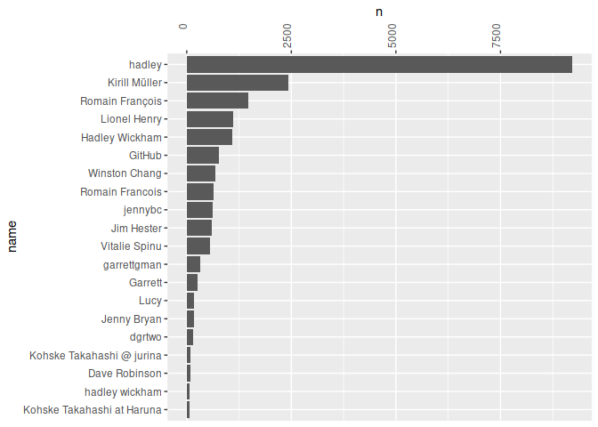
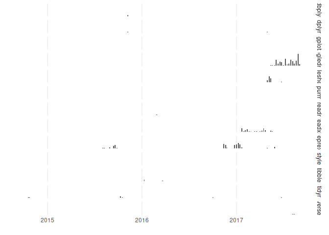

Exploratory analysis of tidyverse activity
================
Duncan Garmonsway
Thu Mar 15 00:14:07 2018

``` r
library(tidyverse)
library(gh)
library(git2r)
library(fs)
library(lubridate)
library(tibbletime)
library(here)

dir_create(here::here("repos"))

tidyverse_members <- gh("/orgs/:org/members", org = "tidyverse")
member_names <- map_chr(tidyverse_members, ~ .x[["login"]])

tidyverse_repos <- gh("/orgs/:org/repos", org = "tidyverse")
```

Clone/pull all the repos locally

``` r
tidyverse_repos %>%
  map_chr(~ .x[["ssh_url"]]) %>%
  tibble(name = str_extract(basename(.), "^.*(?=\\.)"),
         url = .,
         local_path = path("repos", name)) %>%
  # pwalk(~ clone(..2, ..3)) %>%
  # pwalk(~ pull(repository(..3))) %>%
  print(n = Inf)
```

    ## # A tibble: 27 x 3
    ##    name          url                                   local_path         
    ##    <chr>         <chr>                                 <fs::path>         
    ##  1 ggplot2       git@github.com:tidyverse/ggplot2.git  repos/ggplot2      
    ##  2 lubridate     git@github.com:tidyverse/lubridate.g… repos/lubridate    
    ##  3 stringr       git@github.com:tidyverse/stringr.git  repos/stringr      
    ##  4 dplyr         git@github.com:tidyverse/dplyr.git    repos/dplyr        
    ##  5 readr         git@github.com:tidyverse/readr.git    repos/readr        
    ##  6 magrittr      git@github.com:tidyverse/magrittr.git repos/magrittr     
    ##  7 tidyr         git@github.com:tidyverse/tidyr.git    repos/tidyr        
    ##  8 broom         git@github.com:tidyverse/broom.git    repos/broom        
    ##  9 purrr         git@github.com:tidyverse/purrr.git    repos/purrr        
    ## 10 haven         git@github.com:tidyverse/haven.git    repos/haven        
    ## 11 readxl        git@github.com:tidyverse/readxl.git   repos/readxl       
    ## 12 reprex        git@github.com:tidyverse/reprex.git   repos/reprex       
    ## 13 tibble        git@github.com:tidyverse/tibble.git   repos/tibble       
    ## 14 hms           git@github.com:tidyverse/hms.git      repos/hms          
    ## 15 modelr        git@github.com:tidyverse/modelr.git   repos/modelr       
    ## 16 forcats       git@github.com:tidyverse/forcats.git  repos/forcats      
    ## 17 tidyverse     git@github.com:tidyverse/tidyverse.g… repos/tidyverse    
    ## 18 tidytemplate  git@github.com:tidyverse/tidytemplat… repos/tidytemplate 
    ## 19 blob          git@github.com:tidyverse/blob.git     repos/blob         
    ## 20 ggplot2-docs  git@github.com:tidyverse/ggplot2-doc… repos/ggplot2-docs 
    ## 21 glue          git@github.com:tidyverse/glue.git     repos/glue         
    ## 22 style         git@github.com:tidyverse/style.git    repos/style        
    ## 23 dbplyr        git@github.com:tidyverse/dbplyr.git   repos/dbplyr       
    ## 24 googledrive   git@github.com:tidyverse/googledrive… repos/googledrive  
    ## 25 googlesheets4 git@github.com:tidyverse/googlesheet… repos/googlesheets4
    ## 26 tidyselect    git@github.com:tidyverse/tidyselect.… repos/tidyselect   
    ## 27 tidyverse.org git@github.com:tidyverse/tidyverse.o… repos/tidyverse.org

``` r
repo_dirs <- dir_ls(here::here("repos"))
```

Structure of a commit

``` r
commits(repository(as.character(repo_dirs[1]))) %>%
  .[[1]] %>% str()
```

    ## Formal class 'git_commit' [package "git2r"] with 6 slots
    ##   ..@ sha      : chr "bef080ca9fbf916abbcc6effb69f124991fc740b"
    ##   ..@ author   :Formal class 'git_signature' [package "git2r"] with 3 slots
    ##   .. .. ..@ name : chr "Kirill Müller"
    ##   .. .. ..@ email: chr "krlmlr+r@mailbox.org"
    ##   .. .. ..@ when :Formal class 'git_time' [package "git2r"] with 2 slots
    ##   .. .. .. .. ..@ time  : num 1.51e+09
    ##   .. .. .. .. ..@ offset: num 60
    ##   ..@ committer:Formal class 'git_signature' [package "git2r"] with 3 slots
    ##   .. .. ..@ name : chr "Kirill Müller"
    ##   .. .. ..@ email: chr "krlmlr+r@mailbox.org"
    ##   .. .. ..@ when :Formal class 'git_time' [package "git2r"] with 2 slots
    ##   .. .. .. .. ..@ time  : num 1.51e+09
    ##   .. .. .. .. ..@ offset: num 60
    ##   ..@ summary  : chr "Merge tag 'v1.1.0.9001'"
    ##   ..@ message  : chr "Merge tag 'v1.1.0.9001'\n\n- Now using the prettyunits package to format data sizes.\n"
    ##   ..@ repo     :Formal class 'git_repository' [package "git2r"] with 1 slot
    ##   .. .. ..@ path: chr "/home/nacnudus/R/rstudioeye/repos/blob"

``` r
tidyverse_commits <-
  repo_dirs %>%
  tibble(repo_dir = .,
         commit = map(repo_dir, ~ commits(repository(as.character(.x))))) %>%
  unnest() %>%
  # slice(1:10) %>%
  mutate(repo = basename(repo_dir),
         committed = ymd_hms(map_chr(commit, when)),
         name = map_chr(commit, ~ .x@committer@name),
         email = map_chr(commit, ~ .x@committer@email))
tidyverse_commits
```

    ## # A tibble: 22,376 x 6
    ##    repo_dir                               commit repo  committed          
    ##    <fs::path>                             <list> <chr> <dttm>             
    ##  1 /home/nacnudus/R/rstudioeye/repos/blob <S4: … blob  2017-11-30 10:35:21
    ##  2 /home/nacnudus/R/rstudioeye/repos/blob <S4: … blob  2017-11-30 10:35:17
    ##  3 /home/nacnudus/R/rstudioeye/repos/blob <S4: … blob  2017-11-30 10:35:15
    ##  4 /home/nacnudus/R/rstudioeye/repos/blob <S4: … blob  2017-11-30 10:35:08
    ##  5 /home/nacnudus/R/rstudioeye/repos/blob <S4: … blob  2017-11-29 16:05:04
    ##  6 /home/nacnudus/R/rstudioeye/repos/blob <S4: … blob  2017-11-29 09:40:17
    ##  7 /home/nacnudus/R/rstudioeye/repos/blob <S4: … blob  2017-11-29 09:40:13
    ##  8 /home/nacnudus/R/rstudioeye/repos/blob <S4: … blob  2017-11-29 09:40:10
    ##  9 /home/nacnudus/R/rstudioeye/repos/blob <S4: … blob  2017-11-29 09:39:44
    ## 10 /home/nacnudus/R/rstudioeye/repos/blob <S4: … blob  2017-11-29 09:38:20
    ## # ... with 22,366 more rows, and 2 more variables: name <chr>, email <chr>

``` r
periodically <-
  tidyverse_commits %>%
  arrange(committed, repo, email) %>%
  as_tbl_time(index = committed) %>%
  select(repo, committed, email) %>%
  collapse_by("weekly", start_date = min(floor_date(.$committed, "week"))) %>%
  count(repo, committed, email)
periodically
```

    ## # A time tibble: 3,302 x 4
    ## # Index: committed
    ##    repo  committed           email                        n
    ##    <chr> <dttm>              <chr>                    <int>
    ##  1 blob  2016-10-28 16:43:49 h.wickham@gmail.com         11
    ##  2 blob  2016-10-28 16:43:49 james.f.hester@gmail.com     1
    ##  3 blob  2016-11-04 15:23:44 noreply@github.com           1
    ##  4 blob  2016-12-31 23:50:15 h.wickham@gmail.com          6
    ##  5 blob  2017-04-08 22:43:16 krlmlr+r@mailbox.org         4
    ##  6 blob  2017-04-08 22:43:16 noreply@github.com           2
    ##  7 blob  2017-06-17 19:15:14 krlmlr+r@mailbox.org        13
    ##  8 blob  2017-06-17 19:15:14 noreply@github.com           1
    ##  9 blob  2017-12-01 12:42:50 krlmlr+r@mailbox.org        14
    ## 10 broom 2014-07-11 15:30:23 dgrtwo@princeton.edu         6
    ## # ... with 3,292 more rows

People have used multiple email addresses

``` r
committers <- count(tidyverse_commits, email, sort = TRUE)
print(committers, n = 20)
```

    ## # A tibble: 344 x 2
    ##    email                               n
    ##    <chr>                           <int>
    ##  1 h.wickham@gmail.com             10368
    ##  2 romain@r-enthusiasts.com         2104
    ##  3 krlmlr+r@mailbox.org             1389
    ##  4 lionel.hry@gmail.com             1107
    ##  5 kirill.mueller@ivt.baug.ethz.ch   940
    ##  6 noreply@github.com                765
    ##  7 winston@stdout.org                693
    ##  8 jenny@stat.ubc.ca                 611
    ##  9 grolemund@gmail.com               601
    ## 10 james.f.hester@gmail.com          592
    ## 11 spinuvit@gmail.com                565
    ## 12 jenny.f.bryan@gmail.com           224
    ## 13 takahashi.kohske@gmail.com        219
    ## 14 ld.mcgowan@vanderbilt.edu         178
    ## 15 dgrtwo@princeton.edu              177
    ## 16 stefan@stefanbache.dk             116
    ## 17 krlmlr@users.noreply.github.com    90
    ## 18 drobinson@stackoverflow.com        85
    ## 19 irisson@normalesup.org             57
    ## 20 dchiu@bccrc.ca                     50
    ## # ... with 324 more rows

People have used multiple names

``` r
committers <- count(tidyverse_commits, name, sort = TRUE)
print(committers, n = 20)
```

    ## # A tibble: 351 x 2
    ##    name                           n
    ##    <chr>                      <int>
    ##  1 hadley                      9215
    ##  2 Kirill Müller               2419
    ##  3 Romain François             1481
    ##  4 Lionel Henry                1107
    ##  5 Hadley Wickham              1079
    ##  6 GitHub                       765
    ##  7 Winston Chang                692
    ##  8 Romain Francois              644
    ##  9 jennybc                      620
    ## 10 Jim Hester                   592
    ## 11 Vitalie Spinu                565
    ## 12 garrettgman                  324
    ## 13 Garrett                      264
    ## 14 Lucy                         178
    ## 15 Jenny Bryan                  164
    ## 16 dgrtwo                       147
    ## 17 Kohske Takahashi @ jurina     96
    ## 18 Dave Robinson                 85
    ## 19 hadley wickham                74
    ## 20 Kohske Takahashi at Haruna    65
    ## # ... with 331 more rows

Distribution of commits by committers

``` r
committers %>%
  slice(1:20) %>%
  mutate(name = fct_reorder(name, n)) %>%
  ggplot(aes(name, n)) +
  geom_bar(stat = "identity") +
  scale_y_continuous(position = "right") +
  coord_flip() +
  theme(axis.text.x = element_text(angle = 90, hjust = 1))
```

<!-- -->

Plot a committer’s commits over time, by package

``` r
periodically %>%
  filter(email %in% c("jenny@stat.ubc.ca", "jenny.f.bryan@gmail.com  ")) %>%
  ggplot(aes(committed, n)) +
  geom_bar(stat = "identity") +
  facet_grid(repo ~ .) +
  xlab("") +
  ylab("") +
  theme_minimal() +
  theme(panel.grid.major.y = element_blank(),
        panel.grid.minor = element_blank(),
        axis.text.y = element_blank())
```

<!-- -->

Look up a commit’s user’s username via the SHA and the API

``` r
first_commits <-
  tidyverse_commits %>%
  mutate(sha = map_chr(commit, ~ .x@sha)) %>%
  group_by(email) %>%
  summarise(n = n(), first_sha = first(sha)) %>%
  arrange(desc(n)) %>%
  slice(1:20) %>%
  print(n = Inf)
```

    ## # A tibble: 20 x 3
    ##    email                               n first_sha                        
    ##    <chr>                           <int> <chr>                            
    ##  1 h.wickham@gmail.com             10368 389065efb0ec8c01b5caf95da8bd88c6…
    ##  2 romain@r-enthusiasts.com         2104 4cda02592680b54b56aab7309b0aad05…
    ##  3 krlmlr+r@mailbox.org             1389 bef080ca9fbf916abbcc6effb69f1249…
    ##  4 lionel.hry@gmail.com             1107 67417ae3157cc8b73fa4e126817c965f…
    ##  5 kirill.mueller@ivt.baug.ethz.ch   940 e9d87c7d2d4ab71069fbc5485f63dc19…
    ##  6 noreply@github.com                765 3ce6bd2b6e4a0c98384ec44ba689abaf…
    ##  7 winston@stdout.org                693 ccb0742e251a7f44b457666f62601801…
    ##  8 jenny@stat.ubc.ca                 611 2bd18518ad35776f7daada5c3badc100…
    ##  9 grolemund@gmail.com               601 152069df98c2b8d39cb54ec9940d09eb…
    ## 10 james.f.hester@gmail.com          592 d67754157cc3906876c621c1bc62de83…
    ## 11 spinuvit@gmail.com                565 1a491703dd1f19b213f145b67ab1f290…
    ## 12 jenny.f.bryan@gmail.com           224 0078d75da7b4af5adfd754a1cf59216f…
    ## 13 takahashi.kohske@gmail.com        219 3c6e0b6becdbaca3bd140614208fccf7…
    ## 14 ld.mcgowan@vanderbilt.edu         178 4694ecb0bfd0b82ce43d9c3f0fc0ba44…
    ## 15 dgrtwo@princeton.edu              177 4152cee2578894e8c26afc5a35af7aee…
    ## 16 stefan@stefanbache.dk             116 00a1fe3305a4914d7c9714fba78fd5f0…
    ## 17 krlmlr@users.noreply.github.com    90 c75c99a1d784269793d8a343e7b08f6c…
    ## 18 drobinson@stackoverflow.com        85 083655c18ad5ae31163e164550b4d798…
    ## 19 irisson@normalesup.org             57 2f77bbe639f220a69e73dfa88058883e…
    ## 20 dchiu@bccrc.ca                     50 2e3b5f31f2b26813f87aaa31bcd6f601…

``` r
xcommit <- gh("/search/commits?q=hash:2bd18518ad35776f7daada5c3badc10005d69ba4",
              .send_headers = c("Accept" = "application/vnd.github.cloak-preview"))
xcommit$items[[1]]$committer$login
```

    ## [1] "jennybc"

``` r
xcommit <- gh("/search/commits?q=hash:0078d75da7b4af5adfd754a1cf59216f34870d0d",
              .send_headers = c("Accept" = "application/vnd.github.cloak-preview"))
xcommit$items[[1]]$committer$login
```

    ## [1] "jennybc"
